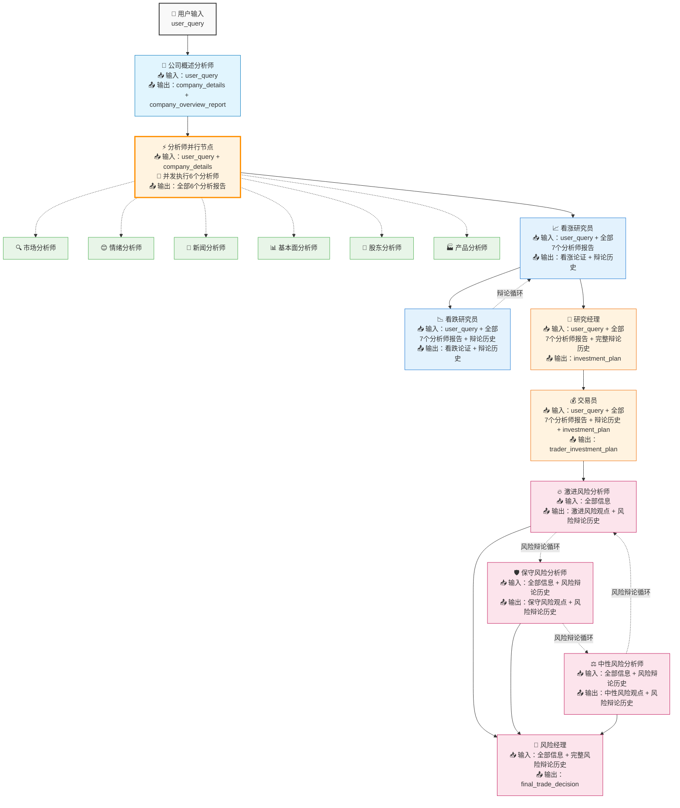

# TradingAgents-MCPmode

基于MCP工具的多智能体交易分析系统

## 🌟 项目概述

**TradingAgents-MCPmode** 是一个创新的多智能体交易分析系统，集成了 Model Context Protocol (MCP) 工具，实现了智能化的股票分析和交易决策流程。系统通过15个专业化智能体的协作，提供全面的市场分析、投资建议和风险管理。

### 🎯 核心特性

- **🤖 多智能体协作**: 15个专业化智能体分工合作
- **⚡ 并行处理**: 分析师团队采用并行架构，显著提升分析效率
- **🔧 MCP工具集成**: 支持外部数据源和实时信息获取
- **📊 全面分析**: 公司概述、市场、情绪、新闻、基本面、股东结构、产品业务七维度分析
- **💭 智能辩论**: 看涨/看跌研究员辩论机制，可配置辩论轮次
- **⚠️ 风险管理**: 三层风险分析和管理决策，支持动态风险辩论
- **🎛️ 智能体控制**: 前端可动态启用/禁用特定智能体，灵活定制工作流
- **🌀 辩论轮次配置**: 前端实时设置投资和风险辩论轮次，精确控制分析深度
- **🔧 灵活配置**: 通过环境变量控制智能体MCP权限
- **🌍 多市场支持**: 美股(US)、A股(CN)、港股(HK)
- **🗣️ 自然语言**: 支持自然语言查询，无需指定市场和日期
- **📈 实时决策**: 基于最新数据的交易建议
- **🌐 Web前端**: 完整的Streamlit Web界面，支持实时分析和历史管理

## 🏗️ 系统架构

### 智能体组织结构

```
┌─────────────────────────────────────────────────────────────┐
│                    TradingAgents-MCPmode                   │
├─────────────────────────────────────────────────────────────┤
│  📊 分析师团队 (Analysts) - 并行执行                         │
│  ├── CompanyOverviewAnalyst (公司概述分析师)               │
│  ├── MarketAnalyst      (市场分析师)        ┐               │
│  ├── SentimentAnalyst   (情绪分析师)        │ 并行处理       │
│  ├── NewsAnalyst        (新闻分析师)        │ 6个分析师      │
│  ├── FundamentalsAnalyst(基本面分析师)      │ 同时执行       │
│  ├── ShareholderAnalyst (股东分析师)        │               │
│  └── ProductAnalyst     (产品分析师)        ┘               │
├─────────────────────────────────────────────────────────────┤
│  🔬 研究员团队 (Researchers)                                │
│  ├── BullResearcher     (看涨研究员)                        │
│  └── BearResearcher     (看跌研究员)                        │
├─────────────────────────────────────────────────────────────┤
│  👔 管理层 (Managers)                                       │
│  ├── ResearchManager    (研究经理)                          │
│  └── Trader             (交易员)                            │
├─────────────────────────────────────────────────────────────┤
│  ⚠️ 风险管理团队 (Risk Management)                          │
│  ├── AggressiveRiskAnalyst (激进风险分析师)                 │
│  ├── SafeRiskAnalyst       (保守风险分析师)                 │
│  ├── NeutralRiskAnalyst    (中性风险分析师)                 │
│  └── RiskManager           (风险经理)                       │
└─────────────────────────────────────────────────────────────┘
```

### 🚀 并行化工作流程



### ⚡ 并行化优势

1. **显著提升效率**: 6个分析师并发执行，总耗时接近最慢分析师的执行时间
2. **资源优化**: 充分利用系统资源，避免串行等待
3. **数据一致性**: 每个分析师使用深拷贝状态，避免并发冲突
4. **结果合并**: 智能合并各分析师的报告和执行历史

#### 在线体验（公网地址）

- 体验地址：`http://47.79.147.241:8501`
- 说明：对外免费开放用于功能体验与演示。
- 注意：请文明使用，务必不要进行任何形式的攻击、压力测试或恶意访问行为，以免影响服务稳定性。


## 🚀 快速开始

### 环境要求

- Python 3.8+
- 支持的操作系统：Windows、macOS、Linux

### 安装步骤

1. **克隆项目**
```bash
git clone https://github.com/guangxiangdebizi/TradingAgents-MCPmode.git
cd TradingAgents-MCPmode
```

2. **安装依赖**
```bash
pip install -r requirements.txt
```

3. **配置环境变量**
```bash
cp env.example .env
# 编辑 .env 文件，配置你的API密钥和工作流参数
```

4. **配置MCP工具**
```bash
# 编辑 mcp_config.json 文件，配置MCP服务器
```

### 🌐 Web前端使用

**推荐使用方式** - 通过Web界面进行交互：

```bash
streamlit run web_app.py
```

然后在浏览器中访问：`http://localhost:8501`


#### Web前端功能

- **🏠 首页**: 系统概览和快速导航
- **⚙️ 系统配置**: 在线编辑.env和MCP配置
- **🔍 实时分析**: 输入查询并实时监控分析进度
- **🤖 智能体控制**: 动态启用/禁用特定智能体，按团队组织的复选框界面
- **🌀 辩论配置**: 实时调整投资和风险辩论轮次，精确控制分析深度
- **📊 智能体页面**: 按团队查看各智能体的详细分析结果
- **📚 历史报告**: 管理历史会话，支持Markdown、PDF、DOCX导出

#### 🎛️ 前端智能体控制特性

**智能体启用控制**：
- ✅ **分组管理**: 按分析师、研究员、管理层、风险管理四大团队组织
- ✅ **实时选择**: 复选框界面，支持全选/全不选快速操作
- ✅ **动态计数**: 实时显示已启用智能体数量 (如: 已启用 12/15)
- ✅ **智能跳过**: 禁用的智能体会自动跳过，不影响工作流连续性

**辩论轮次配置**：
- 🔄 **投资辩论**: 滑块设置看涨/看跌研究员辩论轮次 (每轮=双方各发言1次)
- ⚖️ **风险辩论**: 滑块设置激进/保守/中性风险分析师辩论轮次 (每轮=三方各发言1次)
- 📊 **实时预览**: 显示当前设置及预计发言次数
- 🚀 **自动应用**: 开始分析时自动应用前端设置，无需手动确认

### 💻 命令行使用

如果你偏好命令行方式：

```bash
python main.py -c "分析苹果公司股票"
```

#### 交互模式

```bash
python main.py
```

然后按提示输入你的查询，例如：
- "分析特斯拉股票"
- "给我分析一下600036招商银行"
- "分析NVDA的投资价值"

## 📊 数据流转机制

### 🎯 关键设计特点

1. **company_details占位符系统**
   - 🏢 **公司概述分析师**首先获取公司基础信息
   - 📥 **仅传递给分析师团队**：6个专业分析师都能获得准确的公司背景
   - 🚫 **不传递给后续智能体**：研究员及之后的智能体专注于分析报告综合评估

2. **信息累积效应**
   - **第0阶段**：仅用户查询
   - **第1阶段**：用户查询 + 公司详细信息（并行处理）
   - **第2阶段**：用户查询 + 全部7个分析师报告
   - **第3阶段**：用户查询 + 分析师报告 + 辩论历史 + 投资决策
   - **第4阶段**：用户查询 + 所有信息 + 风险观点

3. **双重辩论机制**
   - **投资辩论**：看涨 ↔ 看跌研究员循环辩论
   - **风险辩论**：激进 ↔ 保守 ↔ 中性风险分析师循环辩论

### 💡 实际应用示例

**用户输入**："分析特斯拉股票"

1. **🏢 公司概述分析师**：获取Tesla Inc.、TSLA、NASDAQ、电动汽车行业等基础信息
2. **⚡ 分析师并行节点**：6个分析师同时基于准确的"Tesla Inc."信息进行专业分析
3. **📈 看涨研究员**：综合所有7个专业分析报告，构建Tesla的看涨投资论证
4. **🎯 风险经理**：基于所有信息和辩论结果，做出Tesla投资的最终风险决策

这种设计确保了**信息的精准传递**和**逐步精炼**，每个智能体都能在最适合的信息环境中发挥专业能力！

## 🎯 使用示例

### 📱 前端操作示例

**场景**: 快速分析苹果公司股票，仅启用核心分析师并设置简化辩论

1. **启动系统**:
   ```bash
   streamlit run web_app.py
   ```

2. **配置智能体** (在"🤖 本轮启用智能体"展开):
   - ✅ 分析师团队: 全选 (7个智能体)
   - ✅ 研究员团队: 仅选择看涨研究员
   - ❌ 管理层: 全不选 (快速分析)
   - ❌ 风险管理: 全不选 (快速分析)
   - 📊 显示: 已启用 8/15

3. **设置辩论轮次** (在"🌀 辩论轮次设置"展开):
   - 🔄 投资辩论轮次: 1轮 (仅看涨研究员发言1次)
   - ⚖️ 风险辩论轮次: 0轮 (跳过风险辩论)

4. **执行分析**:
   - 输入: "分析苹果公司股票的投资价值"
   - 点击"🚀 开始分析"
   - 系统自动应用前端设置并开始执行

5. **预期结果**:
   - ⚡ 快速执行: 仅8个智能体参与，显著减少分析时间
   - 📊 核心报告: 获得7份专业分析师报告
   - 🎯 投资建议: 看涨研究员基于分析师报告提供投资建议

### 🎛️ 动态配置优势

- **🚀 快速体验**: 禁用非核心智能体，1-2分钟获得分析结果
- **🔬 深度分析**: 启用全部智能体+多轮辩论，获得完整决策支持
- **🎯 定制化**: 根据分析需求灵活选择智能体组合
- **💡 实时调整**: 无需重启服务，前端实时调整参数

## 🛠️ 配置说明

### 环境变量配置

在 `.env` 文件中配置以下参数：

```env
# 大模型配置
OPENAI_API_KEY=your_openai_api_key
OPENAI_BASE_URL=https://api.openai.com/v1
MODEL_NAME=gpt-4

# 工作流配置
MAX_DEBATE_ROUNDS=1           # 投资辩论默认轮次（可在前端动态调整）
MAX_RISK_DEBATE_ROUNDS=1      # 风险辩论默认轮次（可在前端动态调整）
DEBUG_MODE=true               # 调试模式，显示详细日志
VERBOSE_LOGGING=true          # 详细日志输出

# 智能体MCP权限配置
# 分析师团队 - 建议开启MCP以获取实时数据
COMPANY_OVERVIEW_ANALYST_MCP=true
MARKET_ANALYST_MCP=true
SENTIMENT_ANALYST_MCP=true
NEWS_ANALYST_MCP=true
FUNDAMENTALS_ANALYST_MCP=true
SHAREHOLDER_ANALYST_MCP=true
PRODUCT_ANALYST_MCP=true

# 研究员/管理/风险团队 - 建议关闭MCP专注综合分析
BULL_RESEARCHER_MCP=false
BEAR_RESEARCHER_MCP=false
RESEARCH_MANAGER_MCP=false
TRADER_MCP=false
AGGRESSIVE_RISK_ANALYST_MCP=false
SAFE_RISK_ANALYST_MCP=false
NEUTRAL_RISK_ANALYST_MCP=false
RISK_MANAGER_MCP=false

# 任务数量并发限制
MAX_CONCURRENT_ANALYSIS=2     # 同时运行的分析任务数量
```

> **💡 提示**: 环境变量中的 `MAX_DEBATE_ROUNDS` 和 `MAX_RISK_DEBATE_ROUNDS` 仅为默认值，实际运行时可在前端实时调整。建议设为1以获得快速体验，如需深度分析可在前端增加轮次。

### MCP工具配置

在 `mcp_config.json` 文件中配置MCP服务器：

```json
{
  "servers": {
    "finance-mcp": {
      "transport": "streamable_http",
      "url": "http://106.14.205.176:8080/mcp",
      "headers": {
        "X-Tushare-Token": "Your-Tushare-APIKEY-Here"
      }
    }
  }
}
```

> 提示：请将 `X-Tushare-Token` 的占位值替换为你的真实 Tushare API Key。修改后如未生效，请重启或热重载你的 MCP 客户端。

## 📈 性能优化

### 并行处理优势

- **原串行架构**: 6个分析师顺序执行，总耗时 = Σ(各分析师耗时)
- **新并行架构**: 6个分析师并发执行，总耗时 ≈ max(各分析师耗时)
- **性能提升**: 理论上可提升5-6倍效率，实际提升取决于各分析师的耗时分布

### 资源管理

- 使用深拷贝避免状态竞争
- 智能合并执行历史和工具调用记录
- 优化内存使用，避免状态冗余

## 🤝 贡献指南

欢迎提交Issue和Pull Request来改进项目！

## 📄 许可证

本项目采用 MIT 许可证。详见 [LICENSE](LICENSE) 文件。

---

**TradingAgents-MCPmode** - 让AI智能体团队为你的投资决策保驾护航！ 🚀📈

## 📬 联系方式

- 邮箱：`guangxiangdebizi@gmail.com`
- LinkedIn：[Xingyu Chen](https://www.linkedin.com/in/xingyu-chen-b5b3b0313/)
- Facebook：[个人主页](https://www.facebook.com/profile.php?id=100072282093932)
- Bilibili：[个人空间](https://space.bilibili.com/51239486?spm_id_from=333.1007.0.0)
